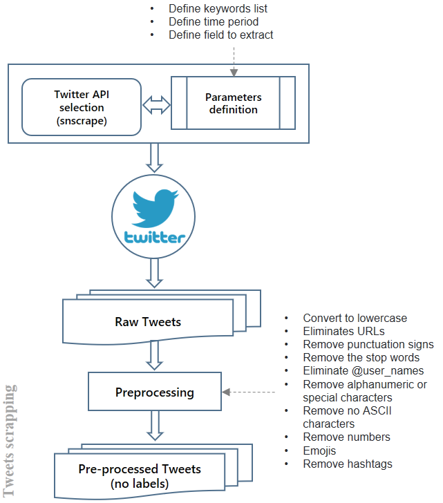

# COVADS
## Data
COVid Dataset of Spanish tweets
This dataset consists of 6,306,621 id tweets in Spanish language collected during the analyzed period with an approximate frequency of 10,000 tweets per day. The tweet collection process was consistent throughout most of the analyzed days. The dataset covers the period from April 1st, 2020 to December 30th, 2021, and includes different search terms such as Covid, Covid19, Covid-19, Coronavirus, SARS-Cov-2. The used parameters and the extracted fields are described in Exploring the Evolution of Sentiment in Spanish Pandemic Tweets: A Data Analysis Based on a Fine-Tuned BERT Archi-tecture paper. This dataset can be a valuable resource for researchers and analysts interested in studying the sentiment and topics related to Covid-19 in the Spanish-speaking population.
 

  

General description of data extraction process.
 
 
Due to Twitter's privacy policies and restrictions, it is not possible to share complete tweets in a dataset. For this reason, in our dataset of Spanish tweets about Covid, we provide only the tweet IDs. The rehydration of the tweets can be performed using the Twitter API, which allows the full content of the tweet to be retrieved from its ID. Twitter may modify or restrict access to its API at any time, which may affect the availability and quality of the rehydrated data. Therefore, it is important to stay updated with the terms and conditions of the Twitter API and have a contingency plan in case of changes in data access.
 
 
<H4>Rehydration of a tweet></H4>
<!-- Código de ejemplo -->
<pre><code class="language-python">

auth = tweepy.OAuth1UserHandler(
    "API_KEY",
    "API_SECRET_KEY",
    "ACCESS_TOKEN",
    "ACCESS_TOKEN_SECRET"
)

# Create API object
api = tweepy.API(auth)

# Example tweet ID
tweet_id = "1234567890"

# Rehydrate tweet
try:
    tweet = api.get_status(tweet_id, tweet_mode="extended")
    print(tweet.full_text)
except tweepy.TweepError as e:
    print(e)
</code></pre>

